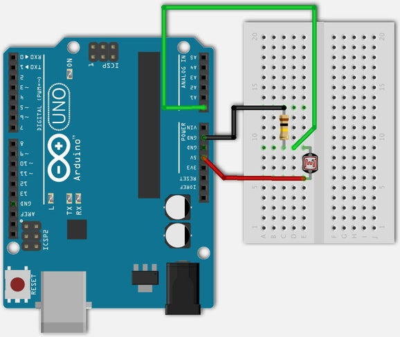
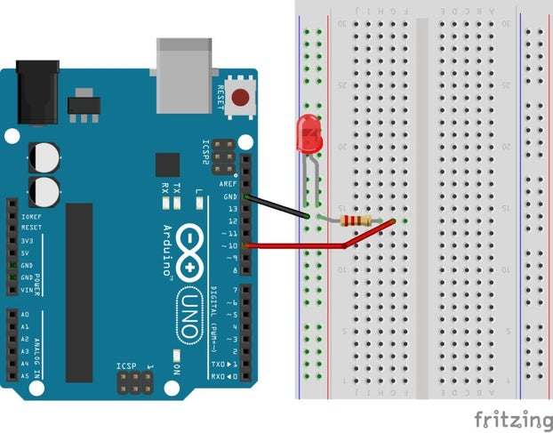

# Lifi-Digital-Arduino

## Equipment used: 
Circuit one:

Circuit one is made to send data. 2 cables an Arduino, a breadboard and an LED is needed. The first picture illustrates the circuit with a resistor.

1. Connect a wire to digital port 10 and to the plus side of the LED (the longest wire is the plus side of the LED).

2. Use a wire to connect the minus side of the LED to the ground port on the Arduino.

Optional step: Add a 220 Ohm resistor to prevent the LED from overheating. Connect as illustrated in the picture.

Circuit two:

Circuit two is made to receive data. 3 cables, an LDR and a 10K ohm resistor are needed to make this circuit. The second picture illustrates the circuit.

1. Use a wire to connect the 5 volts to one side of the LDR.

2. Use a wire to connect the other side of the LDR to analog port A0.

3. Connect the 10k Ohm resistor to the side of the LDR that is connected to port A0, as illustrated in the picture.

4. Connect the other side of the 10k Ohm resistor to the breadboard.

5. Connect the non-connected side of the Ohm resistor to the ground on the Arduino.

### Sources:

https://www.instructables.com/id/Li-Fi-Build-Your-Own-Safe-Wireless-Communication-N/

https://ieeexplore.ieee.org/document/7831279%5D

https://ieeexplore.ieee.org/document/8527234
